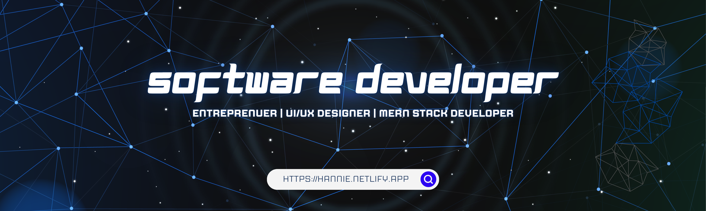

     
  
<!--  
--> 
  
 
   
  <h3>About Me 🎖️</h3> 

 

 
            
 I am highly passionate about learning different programming languages, technologies, and skills that I can use for my work and projects. I have an experience in freelancing particularly in web development and data science and still learning things to grow in the tech industry.

             

 

	<h3>My Current Skillset 🚀</h3> 
	 

 
 
 

 

<h3>My Github Stats 📊</h3>

 
  
 

<!--

-->

<h3>My Trophies 🏆</h3>

